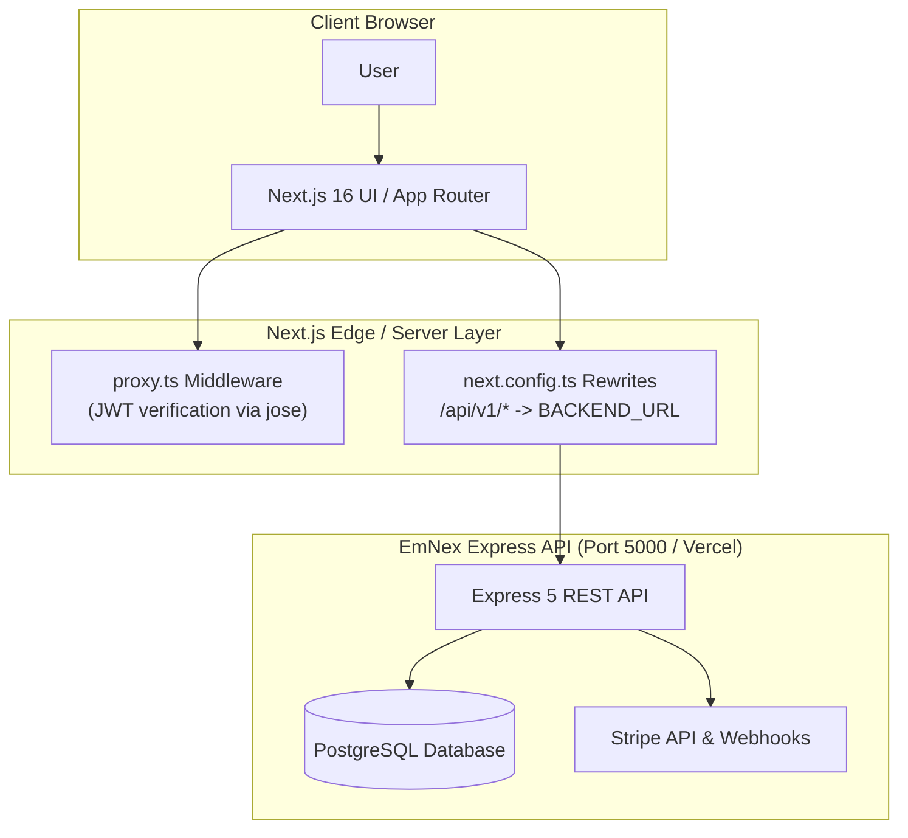
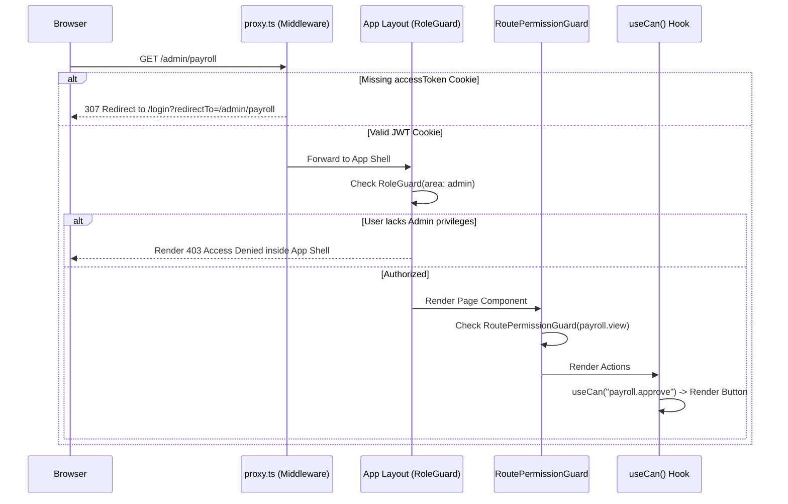
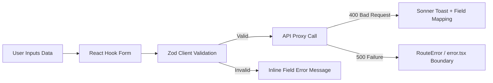
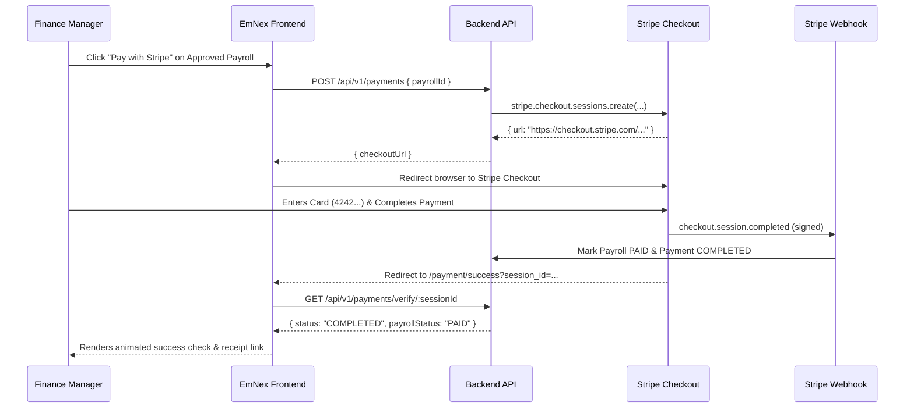

<div align="center">

# 🏛️ EmNex Frontend — Architecture & Engineering Specification

**Deep architectural blueprint of the EmNex Next.js 16 Enterprise Workforce & Payroll web application.**

[](https://nextjs.org)
[](https://react.dev)
[](https://www.typescriptlang.org)
[](https://tailwindcss.com)
[](https://tanstack.com/query)

</div>

---

## 📑 Contents

- [Architectural Overview](#architectural-overview)
- [Three-Tier Defense-in-Depth Access Control](#three-tier-defense-in-depth-access-control)
- [Reverse Proxy & Same-Origin Session Architecture](#reverse-proxy--same-origin-session-architecture)
- [Server & Client Component Boundaries](#server--client-component-boundaries)
- [Server-State & Mutation Invalidation Pipeline](#server-state--mutation-invalidation-pipeline)
- [URL State Synchronization Pattern](#url-state-synchronization-pattern)
- [Form Validation & Error Boundary Strategy](#form-validation--error-boundary-strategy)
- [Stripe Checkout Lifecycle](#stripe-checkout-lifecycle)

---

## 🏗️ Architectural Overview

EmNex Frontend is built on **Next.js 16 App Router**, **React 19**, and **Tailwind CSS 4**. It operates as an authoritative enterprise console serving 4 distinct user tiers:

1. **Executive Administration** (`/admin/*`)
2. **Operations & HR Management** (`/manager/*`)
3. **Finance & Stripe Payroll** (`/finance/*`)
4. **Frontline Specialist Self-Service** (`/dashboard/*`)
5. **High-Converting Public Brand Surfaces** (`/`, `/features`, `/pricing`, `/about`, `/contact`)



---

## 🛡️ Three-Tier Defense-in-Depth Access Control

Access control operates across three coordinated layers so unauthorized actions are neither accessible nor renderable:



### Layer 1: Edge Authentication Gate (`src/proxy.ts`)
- Runs on every incoming request before any page or route handler is invoked.
- Verifies the `accessToken` httpOnly cookie using the shared `JWT_ACCESS_SECRET` via `jose`.
- Anonymous users requesting protected routes are immediately redirected to `/login?redirectTo=<safe_path>`.
- Only relative, same-origin paths are accepted for `redirectTo`, preventing open redirect exploits.

### Layer 2: Area & Route Permission Guards (`src/components/auth/`)
- **`RoleGuard`**: Ensures only users holding the required primary role (or containing adequate permissions) can mount an operational zone (`/admin`, `/manager`, `/finance`, `/dashboard`).
- **`RoutePermissionGuard`**: Validates whether the active user's permissions array contains the exact permission required by that specific route (e.g., `payroll.view` for `/finance/payroll`).
- When denied, it gracefully renders the custom `AccessDenied` view within the standard app shell without crashing or unmounting navigation.

### Layer 3: Action-Level Button Masking (`useCan` hook)
- Every actionable UI control (e.g. *Approve Submission*, *Generate Payroll*, *Delete Department*, *Assign Permissions*) is evaluated using:
  ```tsx
  const canApprove = useCan("submission.approve");
  if (!canApprove) return null;
  ```
- The UI never displays buttons or controls for operations that the backend would reject.

---

## 🌐 Reverse Proxy & Same-Origin Session Architecture

A common failure in modern fullstack architectures is third-party cookie blocking caused by frontend and backend operating on different origins.

EmNex resolves this via a **Next.js Reverse Proxy Rewrite** defined in `next.config.ts`:

```typescript
// next.config.ts
async rewrites() {
  const backendUrl = process.env.BACKEND_URL || "http://localhost:5000";
  return [
    {
      source: "/api/v1/:path*",
      destination: `${backendUrl}/api/v1/:path*`,
    },
  ];
}
```

### Why this matters:
1. **Same-Origin Cookie Policy**: The browser only ever sends requests to `emnex-frontend.vercel.app/api/v1/*`.
2. **Zero CORS Friction**: Cookies set with `SameSite=Lax` or `SameSite=None` belong directly to the frontend origin.
3. **Edge Verification**: The edge middleware (`proxy.ts`) can read and verify the `accessToken` cookie on server requests without cross-domain hops.

---

## ⚡ Server-State & Mutation Invalidation Pipeline

Client-side state is orchestrated via **TanStack Query 5**, organized into one cohesive hook file per domain resource (`src/hooks/*.hook.ts`).

### Query Key Topology & Invalidation Table

| Hook File | Resource | Query Key Pattern | Invalidated On Mutation |
| :--- | :--- | :--- | :--- |
| `useEmployees` | Employees | `["employees", filters]` | `POST /employees`, `PATCH /employees/:id`, `DELETE /employees/:id` |
| `useProjects` | Projects | `["projects", filters]` | `POST /projects`, `PATCH /projects/:id`, `DELETE /projects/:id` |
| `useTasks` | Tasks | `["tasks", filters]`, `["my-tasks"]` | `POST /tasks`, `PATCH /tasks/:id`, `PATCH /tasks/:id/status` |
| `useSubmissions` | Work Hours | `["submissions", filters]`, `["my-submissions"]` | `POST /submissions`, `POST /submissions/:id/approve` |
| `usePayroll` | Payroll Runs | `["payroll", filters]`, `["my-payroll"]` | `POST /payroll/generate`, `POST /payroll/:id/approve` |
| `usePayments` | Payments | `["payments", filters]`, `["my-payments"]` | `POST /payments`, `GET /payments/verify/:sessionId` |

Mutations automatically trigger targeted query invalidation, updating dependent badges, summary cards, and tables across the UI without requiring full-page reloads.

---

## 🔗 URL State Synchronization Pattern

Every list and tabular view across EmNex maintains its complete filter state in the URL using Next.js `useSearchParams`:

```text
/admin/employees?page=2&limit=10&search=Engineering&status=ACTIVE&sortBy=createdAt&sortOrder=desc
```

### Benefits:
- **Shareable Deep Links**: Team members can share exact filtered views.
- **Browser History Support**: Back/forward navigation seamlessly restores filters.
- **Server-Side Renderable**: Query parameters are parsed during SSR for instant initial table hydration.

---

## 📝 Form Validation & Error Boundary Strategy

All user input is validated using **React Hook Form** paired with **Zod** schemas located in `src/validation/`.



- **Client-Side Validation**: Immediate feedback on blur and submit.
- **Server Error Mapping**: If the API returns a 400 with a validation envelope, the error message is mapped directly back to the active form field.
- **Error Boundaries**: Component-level failures render `src/components/shared/route-error.tsx`, isolating errors without crashing the global application shell.

---

## 💳 Stripe Checkout Lifecycle



Both the **Stripe Webhook** and the **Client Return Verification** execute idempotently, guaranteeing that payment state is finalized even if the user closes their browser before the redirect finishes.
