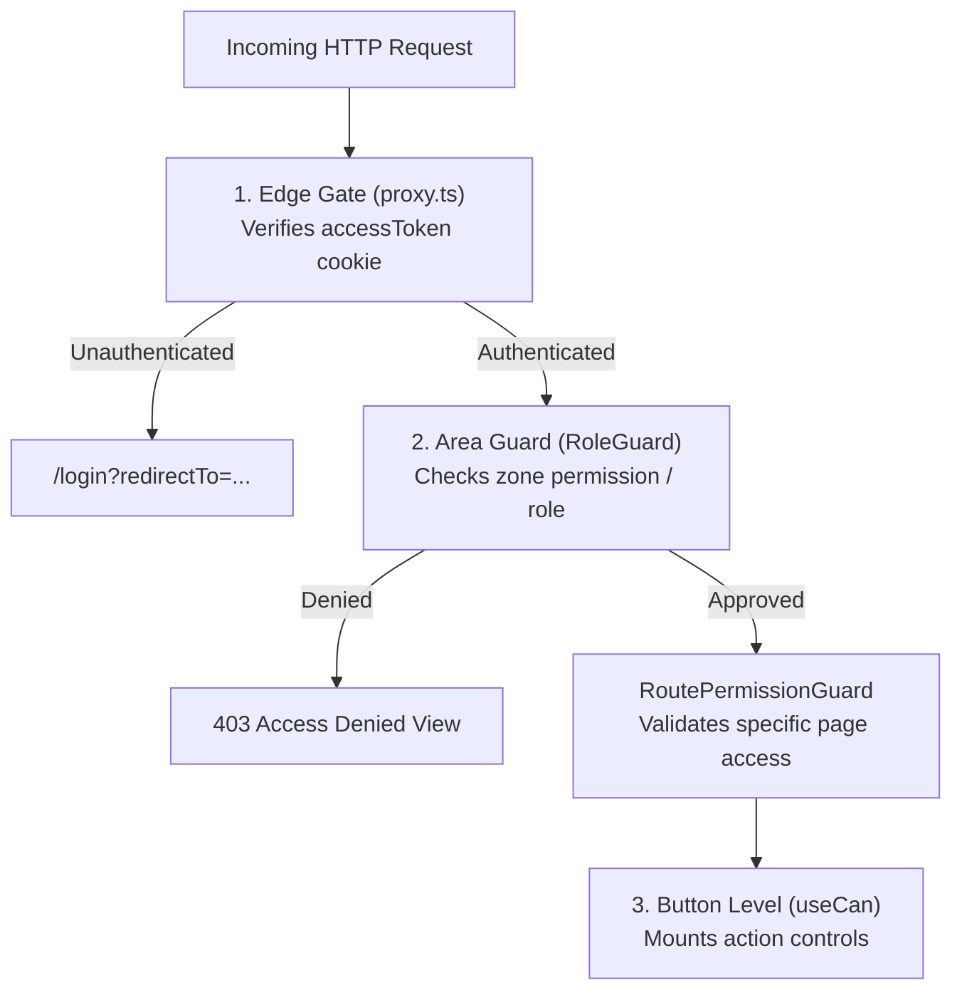

<div align="center">

# 🏢 EmNex — Enterprise Workforce, Dispatch & Payroll Platform

**The modern corporate web application for EmNex: multi-tenant workforce management, field project dispatch, deliverable verification, and automated Stripe payroll.**

Executive Admins orchestrate organizational hierarchies, Operations Managers supervise field execution, and Finance Managers disburse salaries via Stripe — each in a tailored, permission-governed workspace.

[](https://nextjs.org)
[](https://react.dev)
[](https://www.typescriptlang.org)
[](https://tailwindcss.com)
[](https://tanstack.com/query)
[](https://stripe.com)

**🌐 Live Production App:** [emnex-frontend.vercel.app](https://emnex-frontend.vercel.app) &nbsp;·&nbsp; **⚡ Live Backend API:** [emnex-api.vercel.app](https://emnex-api.vercel.app/api/v1) &nbsp;·&nbsp; **📦 Backend Repo:** [emnex-backend](https://github.com/mariyamnavila/emnex-backend)

</div>

---

## 📑 Contents

- [Try It: 1-Click Role Sandbox](#-try-it-1-click-role-sandbox)
- [System Architecture & Visual Design](#-system-architecture--visual-design)
- [36-Page Route Inventory](#-36-page-route-inventory)
- [Core Workspaces & User Flows](#-core-workspaces--user-flows)
- [Tech Stack & Engineering Highlights](#-tech-stack--engineering-highlights)
- [Getting Started Locally](#-getting-started-locally)
- [Environment Configuration](#-environment-configuration)
- [Access Control & Security Architecture](#-access-control--security-architecture)
- [Project Directory Layout](#-project-directory-layout)
- [Comprehensive Documentation Suite](#-comprehensive-documentation-suite)

---

## 🚀 Try It: 1-Click Role Sandbox

The login page features **instant 1-Click Demo Login buttons** that authenticate directly without manual typing:

| Corporate Role | Demo Account | Default Password | Initial Landing View | Primary Responsibilities |
| :--- | :--- | :--- | :--- | :--- |
| **Executive Admin** | `admin@emnex.com` | `EmnexAdmin123!` | [`/admin`](file:///F:/Navila/Milestone-6/EmNex/EmNex-Frontend/src/app/(app)/admin) | Organization roster, department budgeting, custom RBAC matrix, audit log inspection |
| **Operations Manager** | `manager@emnex.com` | `EmnexManager123!` | [`/manager`](file:///F:/Navila/Milestone-6/EmNex/EmNex-Frontend/src/app/(app)/manager) | Kanban task board, deliverable proofs review queue, team workload balancing |
| **Finance Manager** | `finance@emnex.com` | `EmnexFinance123!` | [`/finance`](file:///F:/Navila/Milestone-6/EmNex/EmNex-Frontend/src/app/(app)/finance) | Algorithmic payroll batch runs, gross/net splits, and Stripe Checkout disbursements |
| **Field Specialist** | `employee@emnex.com` | `EmnexEmployee123!` | [`/dashboard`](file:///F:/Navila/Milestone-6/EmNex/EmNex-Frontend/src/app/(app)/dashboard) | Assigned tasks backlog, field hours logging, review feedback, and self-service payslips |

> [!TIP]
> **Stripe Sandbox Testing:** To test financial disbursement as Finance Manager, use Stripe's test card `4242 4242 4242 4242`, any future expiration date (e.g., `12/28`), and any 3-digit CVC.

---

## 🎨 System Architecture & Visual Design

EmNex follows a **Corporate B2B & Executive Workforce SaaS** design system inspired by Stripe Billing, Linear, and Rippling, as codified in [`theme.md`](./theme.md):

- **60-30-10 Color Architecture**: 60% Canvas & White card surfaces (`#F8FAFC` & `#FFFFFF`), 30% Structural Deep Navy (`#0F172A`), and 10% Interactive Royal Blue (`#2563EB`, hover `#1D4ED8`).
- **Hairline Precision**: 1px borders (`#E2E8F0`), micro-shadows (`shadow-xs` / `shadow-2xs`), and zero blurry gradients or glassmorphism.
- **Monospace Financial Numerics**: Monospace tabular figures (`tabular-nums`) across all currency values, hours, dates, and metrics to prevent visual jitter.
- **Micro-State Feedback**: Compact status pills with 6px semantic dots (`#16A34A` Success, `#D97706` Pending, `#DC2626` Critical, `#2563EB` Processing).

---

## 📄 36-Page Route Inventory

EmNex implements and deploys **36 distinct pages and routes** (exceeding the minimum 18-page requirement), detailed in [`PAGES.md`](./PAGES.md):

```text
┌────────────────────────────────────────────────────────────────────────┐
│                        EmNex Route Footprint                           │
├─────────────────┬──────────┬───────────────────────────────────────────┤
│ Workspace       │ Count    │ Key Routes Included                       │
├─────────────────┼──────────┼───────────────────────────────────────────┤
│ Public Brand    │ 5 pages  │ /, /features, /pricing, /about, /contact  │
│ Authentication  │ 2 pages  │ /login (4 Demo buttons), /register        │
│ Executive Admin │ 9 pages  │ /admin, /employees (+ add), /depts,       │
│                 │          │ /projects (+ detail), /payroll, /roles,   │
│                 │          │ /organization, /audit-logs, /profile      │
│ Operations / HR │ 4 pages  │ /manager, /tasks, /submissions, /profile  │
│ Finance Manager │ 4 pages  │ /finance, /payroll, /payments, /profile   │
│ Employee Portal │ 6 pages  │ /dashboard, /tasks, /submissions,         │
│                 │          │ /payroll, /payments, /profile             │
│ Stripe Payments │ 2 pages  │ /payment/success, /payment/cancel         │
│ System / Error  │ 4 pages  │ /_not-found, 403 AccessDenied, error.tsx  │
├─────────────────┴──────────┴───────────────────────────────────────────┤
│ Total: 36 Pages Built & Prerendered                                    │
└────────────────────────────────────────────────────────────────────────┘
```

---

## ⚡ Tech Stack & Engineering Highlights

| Architectural Layer | Implementation | Strategic Purpose |
| :--- | :--- | :--- |
| **Framework** | Next.js 16.3.7 (App Router, Turbopack, React Compiler) | Server-side rendering, streaming, and strict component boundaries |
| **UI Library** | React 19, Tailwind CSS 4, shadcn/ui, Radix primitives | Accessible, keyboard-navigable enterprise components |
| **Server State** | TanStack Query 5 (React Query) | Per-resource hook architecture with targeted cache invalidation |
| **Form Management**| React Hook Form + Zod 4 | Type-safe form validation mirroring backend schemas |
| **Data Analytics** | ApexCharts (`react-apexcharts`) | High-density corporate charts with multi-series comparison |
| **Edge Security** | Next.js Edge Middleware (`proxy.ts`) + `jose` | Cryptographic JWT verification on incoming cookies before route rendering |
| **Same-Origin Proxy**| `next.config.ts` Rewrites | Transparently rewrites `/api/v1/*` to backend, bypassing third-party cookie restrictions |
| **Notifications** | Sonner | Accessible, responsive toast feedback for optimistic mutations |

---

## 🛠️ Getting Started Locally

### Prerequisites
- **Node.js 22+**
- The [EmNex Backend](https://github.com/mariyamnavila/emnex-backend) running locally (default `http://localhost:5000`) with demo seed data.

### 1. Clone & Install
```bash
git clone https://github.com/mariyamnavila/emnex-frontend.git
cd emnex-frontend
npm install
```

### 2. Configure Local Environment
Copy `.env.example` to `.env.local`:
```bash
cp .env.example .env.local
```

| Variable | Required | Description |
| :--- | :---: | :--- |
| `BACKEND_URL` | ✓ | Backend API origin, e.g. `http://localhost:5000` |
| `JWT_ACCESS_SECRET` | ✓ | **Must match the backend's secret** for middleware token verification |
| `NEXT_PUBLIC_DEMO_*` | – | Pre-configured demo account credentials |
| `NEXT_PUBLIC_GOOGLE_CLIENT_ID`| – | Optional Google OAuth Client ID |

### 3. Start Development Server
```bash
npm run dev
```
Open [http://localhost:3000](http://localhost:3000) in your browser.

---

## 🔒 Access Control & Security Architecture

EmNex uses a **Three-Tier Defense-in-Depth** model, documented in [`ARCHITECTURE.md`](./ARCHITECTURE.md):



1. **Edge Gate (`src/proxy.ts`)**: Verifies the session cookie at the network edge. Unauthenticated visitors are sent to `/login` with a safe redirect destination.
2. **Area & Route Guards**: Enforces role and route permission boundaries within the layout shell. Unauthorized visits render a structured 403 view without unmounting navigation.
3. **Action-Level Masking (`useCan`)**: Individual buttons (e.g. *Approve*, *Reassign*, *Generate Payroll*, *Delete*) only render if the active user possesses the exact required permission.

---

## 📂 Project Directory Layout

```text
EmNex-Frontend/
├── src/
│   ├── proxy.ts                  # Edge authentication gate (Next.js middleware)
│   ├── app/
│   │   ├── (public)/             # Landing, Features, Pricing, About, Contact
│   │   ├── (auth)/               # Login (4 demo buttons), Register
│   │   ├── (app)/                # Authenticated shared shell with sidebar & guards:
│   │   │   ├── admin/            #   Executive Admin (9 pages)
│   │   │   ├── manager/          #   Operations & HR (4 pages)
│   │   │   ├── finance/          #   Finance & Payroll (4 pages)
│   │   │   └── dashboard/        #   Employee Self-Service (6 pages)
│   │   ├── payment/              #   Stripe success and cancel redirect pages
│   │   └── error.tsx · not-found.tsx · loading.tsx
│   ├── components/
│   │   ├── ui/                   # shadcn/ui primitives (button, card, dialog, sheet…)
│   │   ├── shared/               # DataTable, StatCard, StatusBadge, RouteError…
│   │   ├── auth/                 # RoleGuard, RoutePermissionGuard, AccessDenied…
│   │   ├── dashboard/            # Shell layout, Command sidebar, UserMenu…
│   │   └── landing/              # Modular landing page components
│   ├── config/sidebar-routes.ts  # Navigation items & permission mappings
│   ├── hooks/                    # TanStack Query resource hooks + useCan, useUrlFilters
│   ├── lib/                      # API client, session management, chart helpers
│   └── validation/               # Zod schemas matching backend validation rules
├── ARCHITECTURE.md               # Deep frontend engineering specification
├── PAGES.md                      # Exhaustive 36-page route & feature breakdown
├── DEPLOYMENT.md                 # Production Vercel deployment guide
└── theme.md                      # Enterprise B2B design tokens & styling guide
```

---

## 📚 Comprehensive Documentation Suite

| Document | Topic & Scope |
| :--- | :--- |
| **[`ARCHITECTURE.md`](./ARCHITECTURE.md)** | Deep architectural guide: App Router split, TanStack Query caching, proxy rewrites, Stripe lifecycle |
| **[`PAGES.md`](./PAGES.md)** | Exhaustive technical catalog of all 36 pages, required permissions, and URL query params |
| **[`DEPLOYMENT.md`](./DEPLOYMENT.md)** | Production deployment walkthrough on Vercel with cookie forwarding and CORS management |
| **[`theme.md`](./theme.md)** | Visual design system: color ratios, hairline borders, typography, and status palettes |
| **[`Backend README`](https://github.com/mariyamnavila/emnex-backend#readme)** | Backend architecture, multi-tenant Postgres schema, Prisma 7, and Express 5 API |
| **[`Backend POSTMAN.md`](https://github.com/mariyamnavila/emnex-backend/blob/main/POSTMAN.md)** | Automated Postman collection testing guide for all 82 API endpoints |
| **[`Backend WORKFLOW.md`](https://github.com/mariyamnavila/emnex-backend/blob/main/WORKFLOW.md)** | Complete business logic runbook: onboarding, hours submission, payroll math, and Stripe rules |
