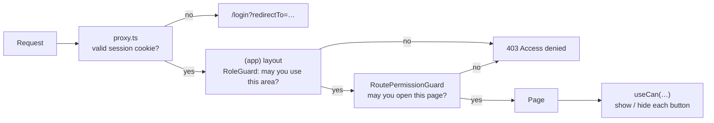

<div align="center">

# EmNex — Frontend

**The web app for EmNex, a multi-tenant workforce, project and payroll platform.**
Admins run projects, employees log hours, HR reviews them, and finance pays salaries through Stripe — each with a workspace built around their permissions.

[](https://nextjs.org)
[](https://react.dev)
[](https://www.typescriptlang.org)
[](https://tailwindcss.com)
[](https://tanstack.com/query)

**Live app:** [emnex-frontend.vercel.app](https://emnex-frontend.vercel.app) · **Backend:** [emnex-backend](https://github.com/mariyamnavila/emnex-backend) · API `https://emnex-api.vercel.app/api/v1`

</div>

---

## Contents

- [Try it](#try-it)
- [What's inside](#whats-inside)
- [Tech stack](#tech-stack)
- [Getting started](#getting-started)
- [How it works](#how-it-works)
- [Project structure](#project-structure)
- [Scripts](#scripts)
- [Deployment](#deployment)
- [Further reading](#further-reading)

---

## Try it

The login page has **one-click demo buttons** for each role. You can also sign in manually:

| Role | Email | Password | Lands on |
| :--- | :--- | :--- | :--- |
| Admin | `admin@emnex.com` | `EmnexAdmin123!` | `/admin` |
| HR Manager | `manager@emnex.com` | `EmnexManager123!` | `/manager` |
| Finance Manager | `finance@emnex.com` | `EmnexFinance123!` | `/finance` |
| Employee | `employee@emnex.com` | `EmnexEmployee123!` | `/dashboard` |

To pay a salary as Finance, use Stripe's test card `4242 4242 4242 4242` with any future date and any CVC.

---

## What's inside

**34 pages**: four signed-in areas, the public site, and the Stripe return pages.

| Area | Pages | Highlights |
| :--- | :--- | :--- |
| **Public** | Home, Features, Pricing, About, Contact, Login, Register | Animated landing sections, pricing calculator, premium auth screens with demo logins and Google sign-in |
| **Admin** `/admin` | Overview, Employees (+ add), Departments, Projects (+ detail), Payroll, Roles, Organization, Audit log, Profile | Org-wide charts; employee onboarding with emailed credentials; custom roles with a permission editor and "reset to defaults"; project detail with task table |
| **HR** `/manager` | Overview, Task board, Work-hours review, Profile | Kanban-style task board (6 columns, filters in the URL), approve / reject queue with written feedback |
| **Finance** `/finance` | Overview, Payroll, Payments, Profile | Generate payroll with live preview (base pay + extra − deductions), approve / reject, pay with Stripe Checkout |
| **Employee** `/dashboard` | Overview, My tasks, My work hours, My payroll, My payments, Profile | Start / submit tasks, log and edit hours, see rejection notes, open payslips |

Every page that lists data has loading skeletons, empty states, and search / filter / pagination kept in the URL (`?page=2&status=ACTIVE`) so views are shareable. Mutations show toast feedback and refresh related data without a reload.

**Status pages** — animated 404, error (500) and access-denied (403) screens. The 403 renders inside the app shell when a signed-in user opens a page their permissions don't allow.

---

## Tech stack

| Concern | Choice |
| :--- | :--- |
| Framework | Next.js 16 (App Router, React Compiler) · React 19 · TypeScript (strict) |
| Styling | Tailwind CSS 4, `tw-animate-css`, shadcn/ui on Radix primitives, Lucide icons |
| Server state | TanStack Query 5 (one hook file per resource) |
| Forms | React Hook Form + Zod (schemas mirror the backend's) |
| Charts | ApexCharts (`react-apexcharts`) |
| Auth | Backend JWT in an httpOnly cookie, verified in `proxy.ts` with `jose`; Google sign-in (`@react-oauth/google`) |
| Feedback | Sonner toasts |
| Dates | `date-fns` |

---

## Getting started

### Prerequisites

- Node.js 22+
- The [EmNex backend](https://github.com/mariyamnavila/emnex-backend) running locally (default `http://localhost:5000`) with demo data seeded

### 1. Install

```bash
git clone https://github.com/mariyamnavila/emnex-frontend.git
cd emnex-frontend
npm install
```

### 2. Configure environment

Copy `.env.example` to `.env.local`:

| Variable | Required | Notes |
| :--- | :---: | :--- |
| `BACKEND_URL` | ✓ | Backend origin, e.g. `http://localhost:5000`. The app forwards `/api/v1/*` there (see [Deployment](#deployment)) |
| `JWT_ACCESS_SECRET` | ✓ | **Exactly the backend's `JWT_ACCESS_SECRET`.** Server-only (no `NEXT_PUBLIC_`): `proxy.ts` uses it to verify the session cookie. If it doesn't match, every page redirects to `/login` |
| `NEXT_PUBLIC_DEMO_*_EMAIL` / `_PASSWORD` | – | Credentials behind the one-click demo buttons (ADMIN, MANAGER, FINANCE, EMPLOYEE). Prefilled with the seeded demo accounts |
| `NEXT_PUBLIC_GOOGLE_CLIENT_ID` | – | Same client ID as the backend's `GOOGLE_CLIENT_ID`; shows the Google button |

On the backend, `FRONTEND_URL` (CORS) and `APP_URL` (Stripe redirects) must point at this app, e.g. `http://localhost:3000`.

### 3. Run

```bash
npm run dev     # http://localhost:3000
```

---

## How it works

### Access control — three layers, one source of truth



1. **`src/proxy.ts`** (Next.js middleware) only answers "are you signed in?". It verifies the `accessToken` cookie with `JWT_ACCESS_SECRET` and sends anonymous visitors to `/login?redirectTo=<page>`. After login they return there — only same-site paths are accepted, so the parameter can't be used to bounce users to another website.
2. **Guards** decide what you may *see*. `RoleGuard` admits you to an area (`/admin`, `/manager`, `/finance`, `/dashboard`) by role **or** by holding any permission that area needs; `RoutePermissionGuard` checks the specific page.
3. **`useCan("permission")`** decides what you may *do* — Approve, Reassign, Generate, Delete… only render when the matching permission is present.

All three read the **permission list from `GET /auth/me`**, and page requirements are derived from the sidebar config (`src/config/sidebar-routes.ts`). The sidebar, the guards and the buttons therefore always agree. Custom roles get exactly the screens their permissions unlock, and "My tasks / My pay" links appear for anyone with the matching `*_own` permission and an employee record.

The backend enforces the same rules on every request; the UI just never offers an action that would be refused.

### Data layer

- **`src/lib/api.ts`** — a small `fetch` wrapper that calls this app's own `/api/v1` (forwarded to the backend — see [Deployment](#deployment)). Sends cookies (`credentials: "include"`), returns the API's `{ success, data, meta }` envelope, and turns failures into a typed `ApiError` whose message is shown to the user.
- **Silent refresh** — on a 401 it calls `/auth/refresh-token` **once** (shared by all requests that failed together) and retries. If the session still can't be restored (401), or the account was blocked or terminated (403), the guard sends the user to `/login`. Network errors, rate limits and server errors never log anyone out.
- **`src/hooks/*.hook.ts`** — one TanStack Query file per resource. Queries are keyed by their filters; mutations invalidate exactly the lists and dashboards they affect, so changes appear everywhere without a reload.
- **`src/validation/*`** — Zod schemas that mirror the backend's, so most mistakes are caught before a request is sent.

### Payments

Finance clicks **Pay** → the app requests a Stripe Checkout URL and redirects → after paying, Stripe returns to `/payment/success?session_id=…`, which calls `GET /payments/verify/:sessionId` to confirm and mark the payroll **Paid** (the Stripe webhook does the same independently). `/payment/cancel` handles abandoned checkouts; the payroll stays approved so it can be retried.

---

## Project structure

```text
src/
├── proxy.ts                 # auth gate (Next.js middleware)
├── app/
│   ├── (public)/            # landing, features, pricing, about, contact
│   ├── (auth)/              # login, register
│   ├── (app)/               # one shared shell (sidebar + guards) for:
│   │   ├── admin/           #   admin area
│   │   ├── manager/         #   HR area
│   │   ├── finance/         #   finance area
│   │   └── dashboard/       #   employee self-service
│   ├── payment/             # Stripe success / cancel
│   ├── error.tsx · not-found.tsx · loading.tsx
│   └── globals.css          # Tailwind 4 theme + custom animations
├── components/
│   ├── ui/                  # shadcn/ui primitives
│   ├── shared/              # DataTable, StatCard, StatusBadge, StatusScreen, pickers…
│   ├── auth/                # login/register, guards, AccessDenied
│   ├── dashboard/           # shell, sidebar, chart cards
│   └── <feature>/           # employees, projects, tasks, payroll, payments, roles…
├── config/sidebar-routes.ts # navigation + the permission each page needs
├── hooks/                   # TanStack Query hooks + useCan, useUrlFilters, useDebounce
├── lib/                     # api client, session, pay/task/chart helpers
├── providers/               # QueryClient, session
├── types/                   # API response types
└── validation/              # Zod form schemas
```

---

## Scripts

| Command | What it does |
| :--- | :--- |
| `npm run dev` | Development server on port 3000 |
| `npm run build` | Production build |
| `npm start` | Serve the production build |
| `npm run lint` | ESLint |

---

## Deployment

Deploy to **Vercel** (or any Next.js host) with:

- `BACKEND_URL` = the production API origin (e.g. `https://emnex-api.vercel.app`)
- `JWT_ACCESS_SECRET` = the production backend's value
- the demo and Google variables from `.env.example`

Then set the backend's `APP_URL` (Stripe redirects) and `FRONTEND_URL` to this app's URL.

**Why the API is forwarded.** `next.config.ts` rewrites `/api/v1/*` to `BACKEND_URL`, so the browser only ever talks to this app's domain:

```text
browser ──► emnex-frontend.vercel.app/api/v1/auth/login ──(rewrite)──► emnex-api.vercel.app/api/v1/auth/login
```

The login cookies the API returns are therefore stored under **this app's** domain, where `proxy.ts` can read them, and there's no cross-site request for CORS or third-party-cookie blocking to interfere with. If the browser called the API's own `*.vercel.app` domain directly, the cookie would be filed under the API's domain and every signed-in page would bounce back to `/login`.

---

## Further reading

| Document | Covers |
| :--- | :--- |
| [theme.md](./theme.md) | Design system: colors, typography, elevation, component patterns |
| [Backend README](https://github.com/mariyamnavila/emnex-backend#readme) | API setup, roles and permissions, security |
| [Backend WORKFLOW.md](https://github.com/mariyamnavila/emnex-backend/blob/main/WORKFLOW.md) | Every business rule the UI reflects (task flow, review, payroll, payments) |
| [Backend API_INTEGRATION.md](https://github.com/mariyamnavila/emnex-backend/blob/main/API_INTEGRATION.md) | All 79 endpoints |
